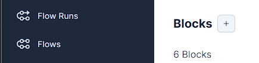
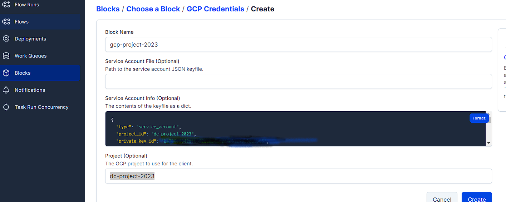
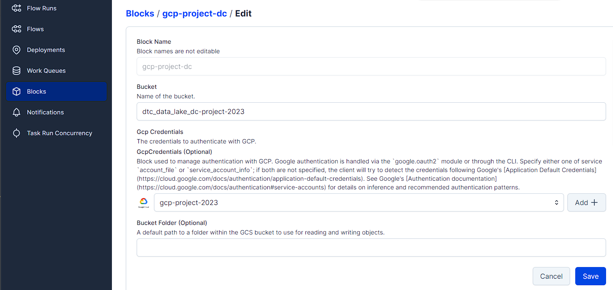
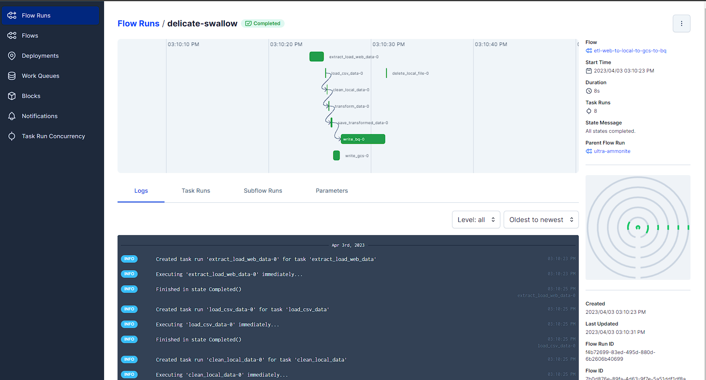
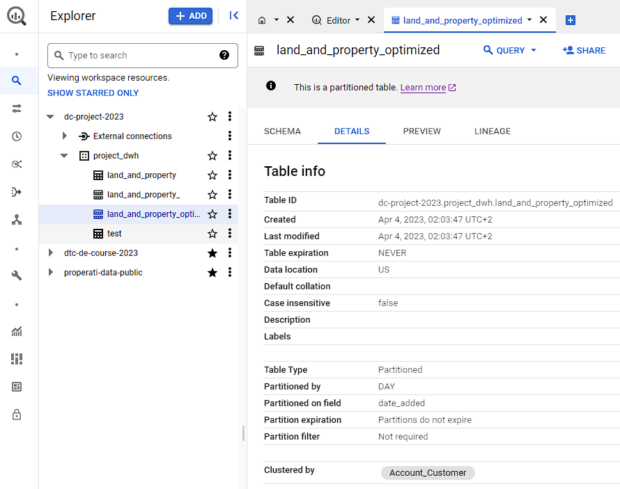

# Problem description

# Execution of the Project

This folling parts will explain,   
how you can reproduce this project on your environment.  

## Prerequisites
---

### Cloud Account
---
 

#### Account  
   Create a Account, [Register here]( https://console.cloud.google.com/)

 

#### Project  
We will create a project with the name "DC-Project-2023" on the [GCloud Site](https://console.cloud.google.com/).  
On the top left you can click on the name of name  
of the current project and select "New Project" on the top right.

 

#### APIs  
Enabe the following APIs. The Project-Name on the top left must be "DC-Project-2023".   
* https://console.cloud.google.com/apis/library/iam.googleapis.com
* https://console.cloud.google.com/apis/library/iamcredentials.googleapis.com

 

#### Service Account
We will need a account for the communication with our  
Cloud environment. In GCloud open the menu on the left top.  
Choose "IAM & Admin". On the menu left select "Service accounts",  
click on "Create Service Account" and create a new account 
with the name "service_account_dc_project_2023".  
Add the following roles:  
Viewer, Storage Admin, Storage Object Admin,  BigQuery Admin

 

#### Service Account Key
We need the authorization key for the created service account.  
In the Mneu "Service Accounts" klick in the list on the name of the account,    
we created in the previous step. The go to the "KEYS" Tab, "Add Key"    
"Create new key". Choose Json and save the file.  
Rename the file to 'service_account_dc_project_2023.json' and    
save it to your home folder in  `$HOME/.google/`  

 

## Local Environment
---

#### Credentials Env Var  
We have to set the path to the credentials json file and save it in a variable.  
export GOOGLE_APPLICATION_CREDENTIALS="<path/to/your/service-account-authkeys>.json".  
We will save it in the .bashrc file in the home folder.  
The following command will add `GOOGLE_APPLICATION_CREDENTIALS="$HOME/.google/service_account_dc_project_2023.json"`  
at the end of the .bashrc file.  
~~~sh
echo GOOGLE_APPLICATION_CREDENTIALS="$HOME/.google/service_account_dc_project_2023.json" >>  $HOME/.bashrc
~~~

#### Terraform

Terraform is an infrastructure as code tool that lets you build, change,   
and version cloud and on-prem resources safely and efficiently.  
With the help opf terraform, we will create the create the infrastructure  
we need on GCP for this project.  

We will create
   - GC Bucket
   - Big Query Dataset

First we need to install terraform on our local machine.  
Follow Instruction based on your local operating system.  
[Terraform install instruction](https://developer.hashicorp.com/terraform/downloads)  

 

#### GCloud SDK
We need the Google SDK for authentication when we use terraform  
https://cloud.google.com/sdk/docs/install-sdk

 

#### Create GCP Infrastructure

First we need to authorize:

~~~sh
gcloud auth application-default login
~~~

Open the link in the browser and copy and paste the 
authorization code.  

After that we initialize terraform,
we need to be in the ./week_7_myproject/_1_Prerequisites folder.
In the folder are the codes for the infratsructure, we want to create.  

~~~sh
terraform init

# First we plan and check changes to new infra plan
terraform plan -var="project=<your-gcp-project-id>"
# For our exapmple it is: 
terraform plan -var="project=dc-project-2023"

# Create new infra
terraform apply -var="project=<your-gcp-project-id>

terraform apply -var="project=dc-project-2023"

~~~

---
## Cloud Environment
---

We will execute everything on the cloud environment.  
We have to prepare the VM. The best OS for this project is Linux.  

### VM Preparing

You can find a deatiled Video about setting up the cloud VM [here](https://www.youtube.com/watch?v=ae-CV2KfoN0&list=PL3MmuxUbc_hJed7dXYoJw8DoCuVHhGEQb).  

This things will be executed:

- Generating SSH keys
- Creating a virtual machine on GCP
- Connecting to the VM with SSH
- Installing Anaconda
- Installing Docker
- Creating SSH config file
- Accessing the remote machine with VS Code and SSH remote
- Installing docker-compose
- Installing pgcli
- Port-forwarding with VS code: connecting to pgAdmin and Jupyter from the local computer
- Installing Terraform
- Using sftp for putting the credentials to the remote machine
- Shutting down and removing the instance

### Repository

If you finished all the points in the previous step,  
the VM is ready to be used.  
Now you have to clone this repository into your home folder.

 

## Project Execution

### Data ingestion 

#### Docker

For Docker we need the host user id.
When we init docker compose,  
it will create 3 folders for Airflow.
If we dont do that, the folders will be created with the root user.  
This would cause problems.    
The result must be saved in a .env file.  

~~~shell
cd $HOME/data-engineering-zoomcamp/week_7_myproject 
echo -e "AIRFLOW_UID=$(id -u)" >> .env
echo AIRFLOW_PROJ_DIR="$HOME/data-engineering-zoomcamp/week_7_myproject/docker_data/airflow" >> .env
~~~

We start the docker compose application:  

~~~docker
cd $HOME/data-engineering-zoomcamp/week_7_myproject 

docker compose up -d
~~~

The Airflow UI will be avaible on `<ip of the machine>:8080`.  
Username / Password is `airflow`.  

 

#### Prefect

Open a new terminal and execute:  

~~~shell
prefect orion start
~~~

Open the Browser and go to [Prefect UI](http://127.0.0.1:4200)

We need to authorize porefect with our GCP Account.  
Herefor we will use the service account credentials.  
Open the Json file Service account file in `$Home/.google/service_account_dc_project_2023.json`  
and copy the content of the file.  

Go in the Prefect UI to "Blocks" and create a new block,  
  
and choose `GCP Credentials`.  
Block Name: gcp-project-2023  
Paste the Json dictionary into the blue field,  
and the Project Name is dc-project-2023.  
  

We create another Block, this time "GCS Bucket".  
At "Gcp Credentials" choose the one you created earlier.

Now we can execute the Python ETL Script

Execute the following in a shell:  

~~~shell
python3 $HOME/data-engineering-zoomcamp/week_7_myproject/orchestra/extract_load_transfortm_web_to_local_to_gcs_to_bq.py
~~~

The Script downloads the csv Files form the UK Government Site,  
transform them and uploads them to Google Cloud Bucket and Big Query.  

When you jump back to the Prefect UI,  
and choose "etl-web-to-local-to-gcs-to-bq" in the "FLows" Tab,  
you can see all runs for this Script and detailed Logs.  

### Data Warehouse

Teh data we want to analyze is now on Big Query.      
As you can see in the details of the table,    
it is not optimized, no Partition, no Cluster.  

We will order the data by date column "date_added",  
so we will Cluster based on this column.  
We will group the data by the Customer,  
so we will Partitio by "Account_Customer".   

Execute ths SQL Script to create the new table "land_and_property_optimized".  

~~~sql
CREATE TEMP TABLE temp_table AS
SELECT *,
  SAFE.PARSE_DATE('%Y-%m-%d', date_added) AS date_added_parsed
FROM `dc-project-2023.project_dwh.land_and_property`;

CREATE OR REPLACE TABLE `dc-project-2023.project_dwh.land_and_property_optimized`
PARTITION BY date_added_parsed
CLUSTER BY Account_Customer 
AS SELECT * FROM temp_table;
~~~

Now we see in the details, that the table is partitioned and clustered.  

