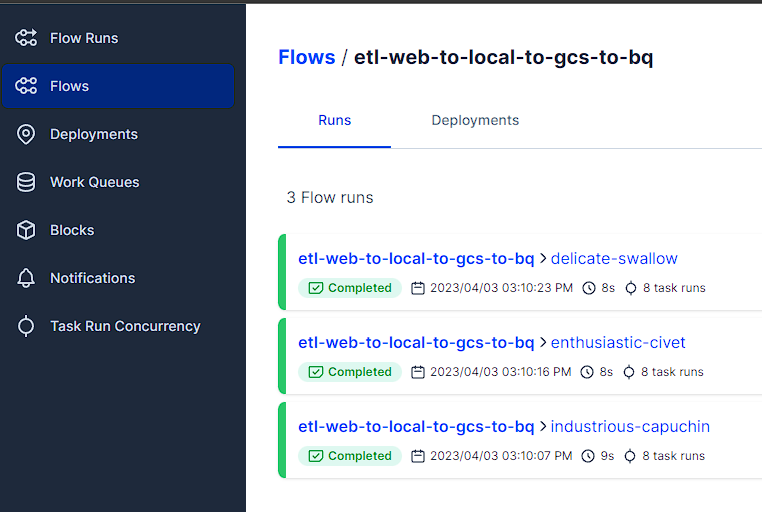

Table of Contents

- [Problem description and Project Overviews](#problem-description-and-project-overviews)
- [Execution of the Project](#execution-of-the-project)
- [Prerequisites](#prerequisites)
  - [Cloud Account](#cloud-account)
    - [Account](#account)
    - [Project](#project)
    - [APIs](#apis)
    - [Service Account](#service-account)
    - [Service Account Key](#service-account-key)
- [Local Environment](#local-environment)
    - [Credentials Env Var](#credentials-env-var)
    - [Terraform](#terraform)
- [Cloud Environment](#cloud-environment)
  - [VM Preparing](#vm-preparing)
  - [Repository](#repository)
- [Project Execution](#project-execution)
  - [Data ingestion](#data-ingestion)
    - [Prefect](#prefect)
  - [Data Warehouse](#data-warehouse)
  - [Transformation](#transformation)
  - [Dashboard](#dashboard)

# Problem description and Project Overviews 

For this Project i will use Data about the number  
and types of applications [HM Land Registry complete each month](https://use-land-property-data.service.gov.uk/datasets/td/download) in 2022.  
Specifically the "Number and types of applications by **all account customers**".  

These are the Steps for analyzing this Data:  
1. Create the Local and Cloud Environment, we need to execute this Project.
2. Download the Data, clean and transform it.
3. Upload this data to Google Bucket and BigQuery
4. Use dbt to transform this Data within the BigQuery Data Warehouse
5. Create Visuals with Metabase based on the transformed Data in the Data Warehouse

# Execution of the Project

This following parts will explain,   
how you can reproduce this project on your environment.  

# Prerequisites
---

## Cloud Account
---
 

### Account  
Create a Account, [Register here]( https://console.cloud.google.com/)

 

### Project  
We will create a project with the name "dc-project-2023" on the [GCloud Site](https://console.cloud.google.com/).  
On the top left you can click on the name of the current project  
and select "New Project" on the top right.  

 

### APIs  
Enabe the following APIs. The Project-Name on the top left must be "DC-Project-2023".   
* https://console.cloud.google.com/apis/library/iam.googleapis.com
* https://console.cloud.google.com/apis/library/iamcredentials.googleapis.com

 

### Service Account
We will need a account for the communication with our  
Cloud environment. In GCloud open the menu on the left top.  
Choose "IAM & Admin". On the menu left select "Service accounts",  
click on "Create Service Account" and create a new account 
with the name "service_account_dc_project_2023".  
Add the following roles:  
Viewer, Storage Admin, Storage Object Admin,  BigQuery Admin

 

### Service Account Key
We need the authorization key for the created service account.  
In the Menu "Service Accounts" click in the list on the name of the account,    
we created in the previous step. The go to the "KEYS" Tab, "Add Key"    
"Create new key". Choose Json and save the file.  
Rename the file to 'service_account_dc_project_2023.json' and    
save it to your home folder in  `$HOME/.google/`.  
Save this file also later, when we create the VM.    

 

# Local Environment
---

### Credentials Env Var  
We have to set the path to the credentials json file and save it in a variable.  
`export GOOGLE_APPLICATION_CREDENTIALS="<path/to/your/service-account-authkeys>.json"`.  
We will save it in the .bashrc file in the home folder.  
The following command will add `GOOGLE_APPLICATION_CREDENTIALS="$HOME/.google/service_account_dc_project_2023.json"`  
at the end of the .bashrc file.  
~~~sh
echo GOOGLE_APPLICATION_CREDENTIALS="$HOME/.google/service_account_dc_project_2023.json" >>  $HOME/.bashrc
~~~

### Terraform

Terraform is a Infrastructure as Code Tool that lets you build, change,   
and version cloud and on-prem resources safely and efficiently.  
With the help opf terraform, we will create the create the infrastructure  
For this Project we need on GCP resources.  
We will create
   - GC Bucket
   - Big Query Dataset

First we need to install terraform on our local machine.  
Follow Instruction based on your local operating system.  
[Terraform install instruction](https://developer.hashicorp.com/terraform/downloads)  

We need the Google SDK for authentication when we use terraform  
https://cloud.google.com/sdk/docs/install-sdk

 

First we need to authorize:

~~~sh
gcloud auth application-default login
~~~

Open the link in the browser and copy and paste the 
authorization code.  

After that we initialize terraform,
we need to be in the ./week_7_myproject/_1_Prerequisites folder.
In the folder are the codes for the infrastructure, we want to create.  

~~~sh
cd $HOME/data-engineering-zoomcamp/week_7_myproject/_1_Prerequisites/

terraform init

# First we plan and check changes to new infra plan
terraform plan -var="project=<your-gcp-project-id>"
# Create new infra
terraform apply -var="project=<your-gcp-project-id>"

# For our exapmple it is: 
terraform plan -var="project=dc-project-2023"
terraform apply -var="project=dc-project-2023"
~~~

---
# Cloud Environment
---

We will execute everything on the cloud environment.  
We have to prepare the Virtual Machine. The best OS for this project is **Linux**.  

## VM Preparing

You can find a detailed Video about setting up the cloud VM [here](https://www.youtube.com/watch?v=ae-CV2KfoN0&list=PL3MmuxUbc_hJed7dXYoJw8DoCuVHhGEQb).  

This things will be executed:

- Generating SSH keys
- Creating a virtual machine on GCP
- Connecting to the VM with SSH
- Installing Python
- Installing Docker
- Creating SSH config file
- Accessing the remote machine with VS Code and SSH remote
- Installing docker-compose
- Installing pgcli
- Using sftp for putting the credentials to the remote machine
- Shutting down and removing the instance

## Repository

If you finished all the points in the previous step,  
the VM is ready to be used.  
Now you have to clone this repository into your **home folder**.

 

# Project Execution

## Data ingestion 

### Prefect

We will use Prefect as our orchestration Tool.  
With the help of Prefect we will execute the Extract, Transform  
and Load Python Script.  

Open a new terminal and execute:  

~~~shell
prefect orion start
~~~

Open the Browser and go to [Prefect UI](http://127.0.0.1:4200)

We need to authorize Prefect with our GCP Account.  
Therefor we will use the service account credentials.  
Open the Json Service account file in `$Home/.google/service_account_dc_project_2023.json`  
and copy the content of the file.  

Go in the Prefect UI to "Blocks" and create a new block,  
  
and choose `GCP Credentials`.  
Block Name: gcp-project-2023  
Paste the Json dictionary into the blue field,  
and the Project Name is dc-project-2023.  
  

We create another Block, this time "GCS Bucket".  
At "Gcp Credentials" choose the one you created earlier.

Now we can execute the Python ETL Script

Execute the following code in a shell terminal:  

~~~shell
python3 $HOME/data-engineering-zoomcamp/week_7_myproject/_2_Orchestration/extract_load_transfortm_web_to_local_to_gcs_to_bq.py
~~~

The Script downloads the csv Files from the UK Government Site,  
transform them and uploads them to Google Cloud Bucket and Big Query.  

When you jump back to the Prefect UI,  
and choose "etl-web-to-local-to-gcs-to-bq" in the "FLows" Tab,  
you can see all runs for this Script and detailed Logs.  

## Data Warehouse

The data we want to analyze is now on Big Query.      
As you can see in the details of the table,    
it is not optimized, no Partition, no Cluster.  

We will order the data by date column "date_added",  
so we will Cluster based on this column.  
We will group the data by the Customer,  
so we will Partition by "Account_Customer".   

Execute ths SQL Script to create the new table "land_and_property_optimized".  

~~~sql
CREATE TEMP TABLE temp_table AS
SELECT * EXCEPT(date_added),
  SAFE.PARSE_DATE('%Y-%m-%d', date_added) AS date_added
FROM `dc-project-2023.project_dwh.land_and_property`;

CREATE OR REPLACE TABLE `dc-project-2023.project_dwh.land_and_property_optimized`
PARTITION BY date_added
CLUSTER BY Account_Customer 
AS SELECT * FROM temp_table;
~~~

Now we see in the details, that the table is partitioned and clustered.  

## Transformation

The data we want to analyze is ready and optimized in Big Query.  
We will now use dbt locally and do some transformations within the Data Warehouse.  

The dbt folder is in `_3_Transformation/dc_project_2023`.

To create a connection and authorization,  
we have to create a dbt profile file in `$HOME/.dbt/profiles.yml`  
The Keyfile is the service account json credentials file in  
`$HOME/.google/service_account_dc_project_2023.json`  

~~~shell
my-bigquery-db:
  target: dev
  outputs:
    dev:
      type: bigquery
      method: service-account
      project: [GCP project id]
      dataset: [the name of your dbt dataset]
      threads: [1 or more]
      keyfile: [/path/to/bigquery/keyfile.json]
~~~

For this project, use this one as profiles.yml:  

~~~
dc_project_2023:
  outputs:
    dev:
      dataset: project_dwh
      job_execution_timeout_seconds: 300
      job_retries: 1
      keyfile: [/path/to/bigquery/keyfile.json]
      location: US
      method: service-account
      priority: interactive
      project: dc-project-2023
      threads: 1
      type: bigquery
  target: dev
~~~

You can find the detailed Setup Documentation of dbt Big Query [here](https://docs.getdbt.com/reference/warehouse-setups/bigquery-setup).  

open a terminal and switch to the dbt folder

~~~sh
cd $HOME/data-engineering-zoomcamp/week_7_myproject/_3_Transformation/dc_project_2023
~~~

We will execute this steps,  
so it will create the views and tables for us,  
based on our dbt models.  

~~~sh
dbt deps
dbt run
~~~

After that we have new object in Big Query,  
based on the models we have defined in the dbt folder.   

 

## Dashboard

Now we want to visualize the data,  
we transformed with dbt in the previous step.  

Therefor we will use Metabase locally with Docker.

Open a terminal and execute:

~~~sh
docker run -d -p 3000:3000 --name metabase metabase/metabase:v0.46.0
~~~

The Metabase UI will be available on `<ip of the machine>:3000`.  

Go though the initial Setup of Metabase.  
In Step 3 "Add your data" choose BigQuery.  
Fill everything with your data and select the service account json file  
from your local machine.  

Now we can use the data from Big Query in Metabase.  
We can use Metabase`s SQL Query and execute our own SQL Queries.  
Than we have the result as a visual and add it to a dashboard.  

We want to know the Top 10 Number of Applications per Customer.  

~~~sql
SELECT
customer,
COUNT(*) as number_of_customer_applications
FROM `dc-project-2023`.project_dwh.final_land_and_property
GROUP BY customer
ORDER BY COUNT(*) DESC
LIMIT 10
~~~

3 Customers have more applications than the other 7 together in the Year 2022.  

Number of Applications per Month

~~~sql
SELECT
DATE_TRUNC(date_added, MONTH),
COUNT(*) as number_of_applications
FROM `dc-project-2023`.project_dwh.final_land_and_property
GROUP BY date_added
ORDER BY date_added
~~~

The Peek of the succeeded Application is from February to May 2022.

You can added both Visuals to a Dashboard.
And here you see both Visuals on a Metabase Dashboard:

